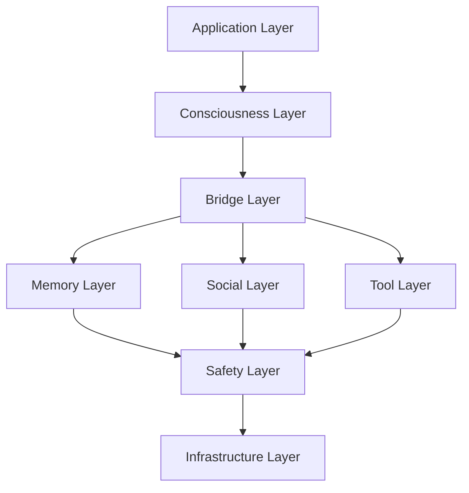

# 🏗️ Layered Architecture Design

## Overview

Loki employs a sophisticated layered architecture where each layer has distinct responsibilities and communicates through well-defined interfaces. This design ensures modularity, scalability, and maintainability across the 542,000+ lines of code.

## Architecture Layers

```
┌─────────────────────────────────────────────────────────────────┐
│                     APPLICATION LAYER                            │
│              TUI • CLI • Web UI • API • Plugins                 │
└─────────────────────────────────────────────────────────────────┘
                                 │
                                 ▼
┌─────────────────────────────────────────────────────────────────┐
│                    🧠 CONSCIOUSNESS LAYER                        │
│     Meta-Awareness • Reasoning • Creativity • Decisions         │
│                    100+ Cognitive Modules                       │
└─────────────────────────────────────────────────────────────────┘
                                 │
                                 ▼
┌─────────────────────────────────────────────────────────────────┐
│                      🌉 BRIDGE LAYER                            │
│      EventBridge • CognitiveBridge • MemoryBridge • ToolBridge  │
│                  Cross-Component Communication                  │
└─────────────────────────────────────────────────────────────────┘
                                 │
                    ┌────────────┼────────────┐
                    ▼            ▼            ▼
┌──────────────────────┐ ┌──────────────┐ ┌──────────────────┐
│   💾 MEMORY LAYER    │ │ 🤝 SOCIAL    │ │  🔧 TOOL LAYER   │
│  Hierarchical Memory │ │    LAYER     │ │ 16+ Categories   │
│  Knowledge Graphs    │ │ Multi-Agent  │ │ Parallel Exec    │
│  SIMD Cache         │ │ Coordination │ │ MCP Integration  │
└──────────────────────┘ └──────────────┘ └──────────────────┘
                                 │
                                 ▼
┌─────────────────────────────────────────────────────────────────┐
│                       🛡️ SAFETY LAYER                           │
│        Validation • Limits • Monitoring • Audit • Security      │
└─────────────────────────────────────────────────────────────────┘
                                 │
                                 ▼
┌─────────────────────────────────────────────────────────────────┐
│                    📊 INFRASTRUCTURE LAYER                       │
│          Storage • Network • Compute • Monitoring • Logs        │
└─────────────────────────────────────────────────────────────────┘
```

## Layer Descriptions

### 1. Application Layer

The user-facing interface layer providing multiple interaction modes:

**Components:**
- **TUI (Terminal UI)**: Rich terminal interface with tabs and real-time updates
- **CLI**: Command-line interface for scripting and automation
- **Web UI**: Browser-based interface (optional)
- **API**: RESTful/GraphQL APIs for external integration
- **Plugins**: Extension points for custom functionality

**Responsibilities:**
- User interaction handling
- Input validation and formatting
- Response presentation
- Session management
- Plugin loading and management

**Key Files:**
```rust
src/tui/         // Terminal UI implementation
src/cli/         // CLI commands
src/ui/          // Web UI server
src/plugins/     // Plugin system
```

### 2. Consciousness Layer

The cognitive core implementing advanced AI capabilities:

**Components:**
- **Meta-Awareness**: Self-monitoring and introspection
- **Reasoning Engines**: Multiple reasoning strategies
- **Creativity Engine**: Novel idea generation
- **Decision Engine**: Complex decision-making
- **Theory of Mind**: Understanding others' mental states
- **Empathy System**: Emotional understanding

**Responsibilities:**
- Cognitive processing and reasoning
- Self-awareness and meta-cognition
- Creative problem-solving
- Decision-making with uncertainty
- Learning and adaptation

**Key Modules:**
```rust
src/cognitive/consciousness_stream.rs
src/cognitive/reasoning_engines.rs
src/cognitive/decision_engine.rs
src/cognitive/theory_of_mind.rs
src/cognitive/empathy_system.rs
```

### 3. Bridge Layer

The communication backbone connecting all components:

**Components:**
- **EventBridge**: Central event routing
- **CognitiveBridge**: Cognitive system interface
- **MemoryBridge**: Memory system interface
- **ToolBridge**: Tool execution interface

**Responsibilities:**
- Message routing and filtering
- Protocol translation
- Asynchronous communication
- Load balancing
- Circuit breaking and resilience

**Implementation:**
```rust
pub trait Bridge: Send + Sync {
    type Request;
    type Response;
    
    async fn send(&self, req: Self::Request) -> Result<Self::Response>;
    async fn subscribe(&self, handler: Box<dyn Handler>);
}
```

### 4. Memory Layer

Hierarchical memory system inspired by human cognition:

**Components:**
- **Working Memory**: Active cognitive workspace (7±2 items)
- **Short-term Memory**: Recent context (hours)
- **Long-term Memory**: Persistent knowledge
- **SIMD Cache**: Vectorized operations
- **Knowledge Graphs**: Relationship networks

**Responsibilities:**
- Memory encoding and storage
- Retrieval and search
- Forgetting and consolidation
- Cache management
- Knowledge organization

### 5. Social Layer

Multi-agent coordination and external social interaction:

**Components:**
- **Agent Coordinator**: Multi-agent management
- **Social Platforms**: X/Twitter, Slack, Discord
- **Collaboration Engine**: Agent cooperation
- **Community Interface**: User community interaction

**Responsibilities:**
- Agent spawning and management
- Inter-agent communication
- Social platform integration
- Collaborative problem-solving

### 6. Tool Layer

External world interaction through tools:

**Components:**
- **Development Tools**: GitHub, code analysis
- **Web Tools**: Search, browsing, scraping
- **Data Tools**: Databases, analytics
- **Creative Tools**: Media generation
- **System Tools**: File system, processes

**Responsibilities:**
- Tool discovery and registration
- Parallel tool execution
- Rate limiting and quotas
- Result aggregation
- Error recovery

### 7. Safety Layer

Comprehensive safety and security mechanisms:

**Components:**
- **Input Validation**: Sanitization and verification
- **Resource Limits**: CPU, memory, time constraints
- **Audit System**: Activity logging
- **Security Policies**: Access control
- **Anomaly Detection**: Unusual behavior detection

**Responsibilities:**
- Enforcing safety constraints
- Resource usage monitoring
- Security policy enforcement
- Audit trail maintenance
- Incident response

### 8. Infrastructure Layer

Low-level system services and resources:

**Components:**
- **Storage**: RocksDB, file systems
- **Network**: HTTP clients, WebSockets
- **Compute**: Thread pools, GPU access
- **Monitoring**: Metrics, tracing
- **Logging**: Structured logging

**Responsibilities:**
- Resource management
- Performance optimization
- System monitoring
- Log aggregation
- Infrastructure abstraction

## Inter-Layer Communication

### Communication Patterns

```rust
// Upward Communication (Request)
Request → Bridge → Higher Layer → Response

// Downward Communication (Command)
Command → Bridge → Lower Layer → Result

// Lateral Communication (Event)
Event → EventBridge → Subscribers
```

### Message Flow Example

```rust
// User request flow through layers
User Input (Application Layer)
    ↓
Cognitive Processing (Consciousness Layer)
    ↓
Memory Retrieval (via MemoryBridge)
    ↓
Tool Execution (via ToolBridge)
    ↓
Safety Validation (Safety Layer)
    ↓
Response Generation
    ↓
User Output (Application Layer)
```

## Layer Isolation

Each layer maintains isolation through:

### 1. Interface Contracts
```rust
pub trait Layer {
    type Config;
    type State;
    
    fn initialize(config: Self::Config) -> Result<Self>;
    async fn process(&mut self, input: Input) -> Result<Output>;
    fn shutdown(self) -> Result<()>;
}
```

### 2. Dependency Injection
```rust
pub struct ConsciousnessLayer {
    memory: Arc<dyn MemoryInterface>,
    tools: Arc<dyn ToolInterface>,
    bridge: Arc<dyn BridgeInterface>,
}
```

### 3. Error Boundaries
```rust
impl Layer for ConsciousnessLayer {
    async fn process(&mut self, input: Input) -> Result<Output> {
        self.process_internal(input)
            .await
            .or_else(|e| self.handle_error(e))
    }
}
```

## Configuration Per Layer

```yaml
layers:
  application:
    tui:
      refresh_rate: 60fps
      theme: dark
    api:
      port: 8080
      
  consciousness:
    max_reasoning_depth: 10
    parallel_thoughts: 3
    
  bridge:
    event_queue_size: 10000
    max_subscribers: 100
    
  memory:
    cache_size: 1GB
    persistence: true
    
  social:
    max_agents: 10
    
  tools:
    max_parallel: 5
    timeout: 30s
    
  safety:
    max_tokens: 4000
    rate_limit: 100/min
    
  infrastructure:
    max_threads: 8
    log_level: info
```

## Benefits of Layered Design

### 1. **Modularity**
- Each layer can be developed independently
- Clear separation of concerns
- Easy to understand and maintain

### 2. **Scalability**
- Layers can scale independently
- Horizontal scaling at each layer
- Load distribution across layers

### 3. **Testability**
- Each layer can be tested in isolation
- Mock interfaces for testing
- Clear test boundaries

### 4. **Flexibility**
- Easy to swap implementations
- Add new features without affecting other layers
- Progressive enhancement

### 5. **Resilience**
- Failure isolation
- Graceful degradation
- Circuit breakers between layers

## Layer Dependencies



## Best Practices

### 1. **Layer Boundaries**
- Never bypass layers
- Use bridges for cross-layer communication
- Maintain clean interfaces

### 2. **Data Flow**
- Validate data at layer boundaries
- Transform data appropriately
- Handle errors at each layer

### 3. **Performance**
- Cache at appropriate layers
- Minimize layer crossings
- Batch operations when possible

### 4. **Security**
- Authenticate at application layer
- Authorize at bridge layer
- Validate at safety layer
- Audit at infrastructure layer

## Future Enhancements

### Planned Improvements
1. **Dynamic Layer Loading**: Hot-swappable layers
2. **Layer Orchestration**: Automated layer management
3. **Cross-Layer Optimization**: Performance improvements
4. **Layer Monitoring**: Enhanced observability
5. **Layer Versioning**: Support multiple versions

---

Next: [Data Flow](data_flow.md) | [Bridge System](bridge_system.md)